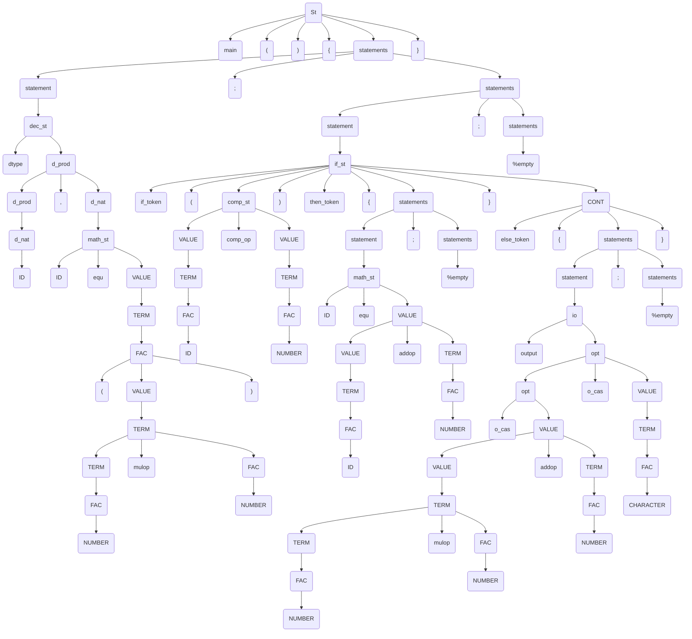

```mermaid
graph TD
46(d_nat) --> 5("ID");
47(d_prod) --> 46(d_nat);
48(FAC) --> 10("NUMBER");
49(TERM) --> 48(FAC);
50(FAC) --> 12("NUMBER");
51(TERM) --> 49(TERM);
51(TERM) --> 11("mulop");
51(TERM) --> 50(FAC);
52(VALUE) --> 51(TERM);
53(FAC) --> 9("(");
53(FAC) --> 52(VALUE);
53(FAC) --> 13(")");
54(TERM) --> 53(FAC);
55(VALUE) --> 54(TERM);
56(math_st) --> 7("ID");
56(math_st) --> 8("equ");
56(math_st) --> 55(VALUE);
57(d_nat) --> 56(math_st);
58(d_prod) --> 47(d_prod);
58(d_prod) --> 6(",");
58(d_prod) --> 57(d_nat);
59(dec_st) --> 4("dtype");
59(dec_st) --> 58(d_prod);
60(statement) --> 59(dec_st);
61(FAC) --> 17("ID");
62(TERM) --> 61(FAC);
63(VALUE) --> 62(TERM);
64(FAC) --> 19("NUMBER");
65(TERM) --> 64(FAC);
66(VALUE) --> 65(TERM);
67(comp_st) --> 63(VALUE);
67(comp_st) --> 18("comp_op");
67(comp_st) --> 66(VALUE);
68(FAC) --> 25("ID");
69(TERM) --> 68(FAC);
70(VALUE) --> 69(TERM);
71(FAC) --> 27("NUMBER");
72(TERM) --> 71(FAC);
73(VALUE) --> 70(VALUE);
73(VALUE) --> 26("addop");
73(VALUE) --> 72(TERM);
74(math_st) --> 23("ID");
74(math_st) --> 24("equ");
74(math_st) --> 73(VALUE);
75(statement) --> 74(math_st);
77(statements) --> 76(%empty);
78(statements) --> 75(statement);
78(statements) --> 28(";");
78(statements) --> 77(statements);
79(FAC) --> 34("NUMBER");
80(TERM) --> 79(FAC);
81(FAC) --> 36("NUMBER");
82(TERM) --> 80(TERM);
82(TERM) --> 35("mulop");
82(TERM) --> 81(FAC);
83(VALUE) --> 82(TERM);
84(FAC) --> 38("NUMBER");
85(TERM) --> 84(FAC);
86(VALUE) --> 83(VALUE);
86(VALUE) --> 37("addop");
86(VALUE) --> 85(TERM);
87(opt) --> 33("o_cas");
87(opt) --> 86(VALUE);
88(FAC) --> 40("CHARACTER");
89(TERM) --> 88(FAC);
90(VALUE) --> 89(TERM);
91(opt) --> 87(opt);
91(opt) --> 39("o_cas");
91(opt) --> 90(VALUE);
92(io) --> 32("output");
92(io) --> 91(opt);
93(statement) --> 92(io);
95(statements) --> 94(%empty);
96(statements) --> 93(statement);
96(statements) --> 41(";");
96(statements) --> 95(statements);
97(CONT) --> 30("else_token");
97(CONT) --> 31("{");
97(CONT) --> 96(statements);
97(CONT) --> 42("}");
98(if_st) --> 15("if_token");
98(if_st) --> 16("(");
98(if_st) --> 67(comp_st);
98(if_st) --> 20(")");
98(if_st) --> 21("then_token");
98(if_st) --> 22("{");
98(if_st) --> 78(statements);
98(if_st) --> 29("}");
98(if_st) --> 97(CONT);
99(statement) --> 98(if_st);
101(statements) --> 100(%empty);
102(statements) --> 99(statement);
102(statements) --> 43(";");
102(statements) --> 101(statements);
103(statements) --> 60(statement);
103(statements) --> 14(";");
103(statements) --> 102(statements);
104(St) --> 0("main");
104(St) --> 1("(");
104(St) --> 2(")");
104(St) --> 3("{");
104(St) --> 103(statements);
104(St) --> 44("}");
```
